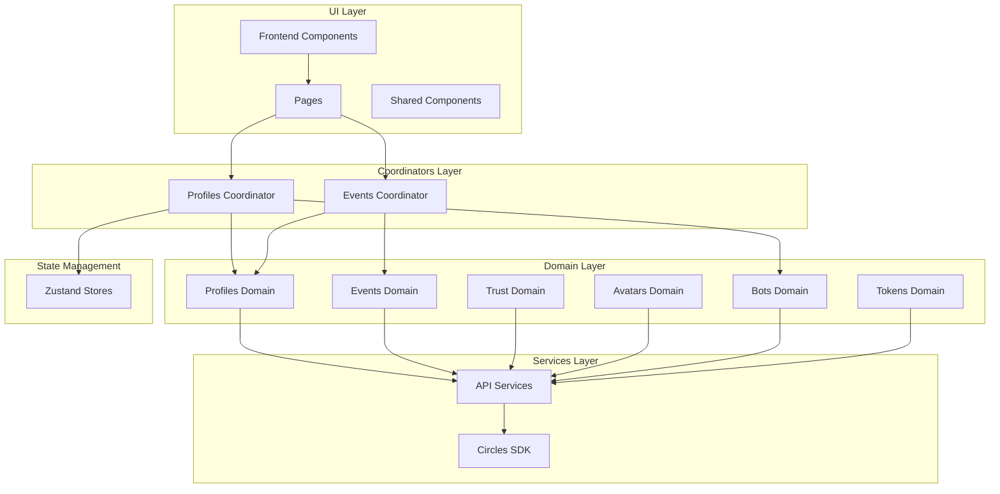

# Circles Explorer


A web application for visualizing and exploring the Circles Protocol.

## What is Circles Protocol?

Circles is a decentralized protocol designed to create and distribute fair and social money through personal currencies. It creates a new form of money that is distributed equally to all participants as a basic income. The system uses personal currencies and a web of trust to create a money system that is both fair and accessible to everyone.

## Features

- **Avatar Exploration**: View detailed information about avatars (humans, organizations, and groups)
- **Trust Network Visualization**: Interactive graph visualization of trust relationships
- **Transaction History**: Explore all transactions and events for any avatar
- **Bot Detection**: Identify potential bot accounts in the network
- **Trust Management**: View and analyze trust relationships between avatars
- **Comprehensive Statistics**: View network-wide statistics and metrics

## Architecture

Circles Explorer follows a domain-driven design (DDD) approach with a clear separation of concerns:



### Key Components

1. **Domain Layer**: Contains domain-specific logic, repositories, adapters, and types
2. **Coordinators**: Orchestrate data fetching and management across multiple domains
3. **UI Components**: React components for rendering the user interface
4. **Services**: API clients and utilities for external communication
5. **State Management**: Global state stores using Zustand

## Project Structure

```
src/
├── domains/           # Domain layer with domain-specific logic
│   ├── avatars/       # Avatar domain
│   ├── bots/          # Bot detection domain
│   ├── events/        # Events domain
│   ├── profiles/      # Profiles domain
│   ├── tokens/        # Tokens domain
│   └── trust/         # Trust relations domain
├── coordinators/      # Coordinators for orchestrating multiple domains
├── hooks/             # React hooks for UI components
├── pages/             # UI pages
├── shared/            # Shared UI components
├── stores/            # Global state stores
├── services/          # API clients and utilities
├── constants/         # Application constants
├── utils/             # Utility functions
└── types/             # Global type definitions
```

### Domain Layer

Each domain contains:

- `types.ts`: Type definitions for the domain
- `adapters.ts`: Adapters for transforming data between different formats
- `repository.ts`: Repository for fetching and managing domain data

### Coordinators Layer

Coordinators orchestrate fetching data from multiple domains and manage the data flow between domains. They are responsible for:

1. Coordinating data fetching from multiple repositories
2. Managing data dependencies between domains
3. Providing a unified API for UI components

Available coordinators:

- `useProfilesCoordinator`: Coordinates fetching profile data and bot verdicts
- `useEventsCoordinator`: Coordinates fetching events data and related profiles

## Getting Started

### Prerequisites

- Node.js 22.3.0 or higher
- pnpm (recommended) or npm

### Installation

1. Clone the repository:

   ```bash
   git clone https://github.com/circles/circles-explorer.git
   cd circles-explorer
   ```

2. Install dependencies:

   ```bash
   pnpm install
   ```

3. Create a `.env` file based on `.env.example`:

   ```bash
   cp .env.example .env
   ```

4. Start the development server:
   ```bash
   pnpm dev
   ```

The application will be available at http://localhost:5173.

## Available Scripts

- `pnpm dev` - Start a development server with hot reload
- `pnpm build` - Build for production (output to `dist` folder)
- `pnpm preview` - Locally preview the production build
- `pnpm test` - Run unit and integration tests related to changed files
- `pnpm test:ci` - Run all unit and integration tests in CI mode
- `pnpm test:e2e` - Run all e2e tests with the Cypress Test Runner
- `pnpm test:e2e:headless` - Run all e2e tests headlessly
- `pnpm format` - Format all files with Prettier
- `pnpm lint` - Run TypeScript, ESLint and Stylelint
- `pnpm validate` - Run `lint`, `test:ci` and `test:e2e:ci`

## Data Flow

1. **UI Components** request data through coordinators
2. **Coordinators** orchestrate data fetching from multiple domains
3. **Domain Repositories** fetch data from external services
4. **Adapters** transform data between external and internal formats
5. **Coordinators** update the global state with the fetched data
6. **UI Components** render data from the global state

## Key Technologies

- **React**: UI library
- **TypeScript**: Type-safe JavaScript
- **Zustand**: State management
- **React Query**: Data fetching and caching
- **Vite**: Build tool
- **TailwindCSS**: Utility-first CSS framework
- **NextUI**: UI component library
- **React Router**: Routing
- **React Force Graph**: Graph visualization
- **Viem**: Ethereum interaction library
- **Circles SDK**: SDK for interacting with the Circles Protocol

## Domain-Driven Design

The application follows a domain-driven design approach with the following principles:

1. **Bounded Contexts**: Each domain represents a bounded context with its own models and logic
2. **Repositories**: Each domain has a repository for data access
3. **Adapters**: Data is transformed between external and internal formats
4. **Aggregates**: Domain objects are grouped into aggregates
5. **Value Objects**: Immutable objects that represent concepts in the domain

## Contributing

Contributions are welcome! Please follow these steps:

1. Fork the repository
2. Create a feature branch: `git checkout -b feature/my-feature`
3. Commit your changes: `git commit -m 'Add my feature'`
4. Push to the branch: `git push origin feature/my-feature`
5. Open a pull request

### Development Workflow

1. Make sure all tests pass before submitting a PR
2. Follow the code style guidelines
3. Write tests for new features
4. Update documentation as needed

## License

This project is licensed under the MIT License - see the LICENSE file for details.

## Acknowledgements

- [Circles Protocol](https://docs.aboutcircles.com/)
- [Gnosis Chain](https://www.gnosis.io/)
- [Metri Wallet](https://metri.xyz/)
- [Group Management App](https://app.aboutcircles.com/)
